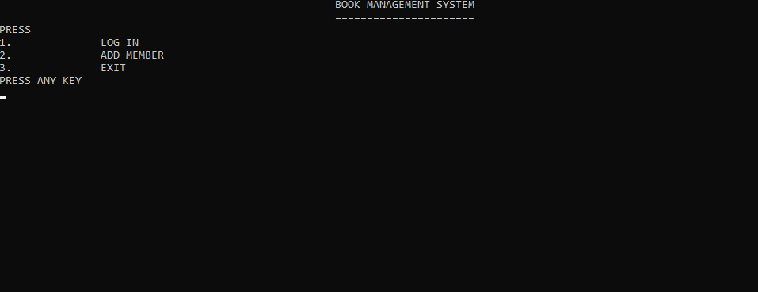

# LIBRARY MANAGEMENT SYSTEM
* A program for the management of books in library. 
* For each function different cpp has been created.
* To run the program authentication is required.

# The Main Menu

